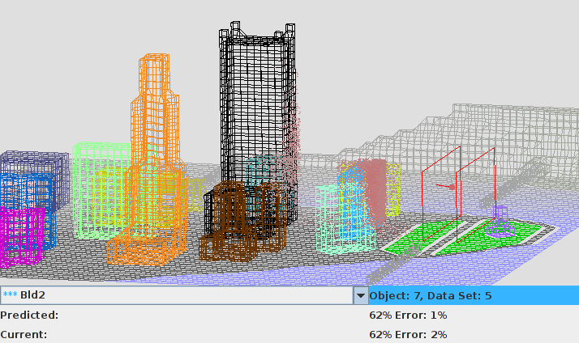

# Risk Analysis System for Aerosol Transport (RASAT)

## [Andrei Smirnov](mailto:andrei.v.smirnov@gmail.com) 

## Summary

The goal of the project is to develop a system of express risk analysis of
possible aerosol dispersion scenarios in city landscapes. In the existing
prototype of this system a database of possible aerosol dispersion scenarios
is created by means of exhaustive parallel CFD simulations. A web based
query system enables one in a matter of seconds to retrieve the answer on
aerosol spreading and deposition in case of an emergency situation.

### [Whitepaper](whitepaper.pdf)

### [Web-simulator of contamination spreading (DEMO)](demo/)

The demo compares predictions of aerosol spreading between the real-time simulation and the database retrieval.
When express assessment is needed a database retrieval of results will always be faster than conducting a physically based simulation.
In this case the database data should be prepared in advance and span a set of most likely scenarios.

The demo runs an actual simulation of aerosol dispersion in a simulated city landscape (Pittsburgh) and shows the results of the fallout on different buildings (red dots). At the same time the simulator retrieves the corresponding data from the pre-recorded data-sets and both results are compared. The results at the bottom of the figure show the percentages of the fallout on the selected object and the corresponding statistical erros.

To run a demo change to [demo](demo/) directory and run

- appletviewer city.html

